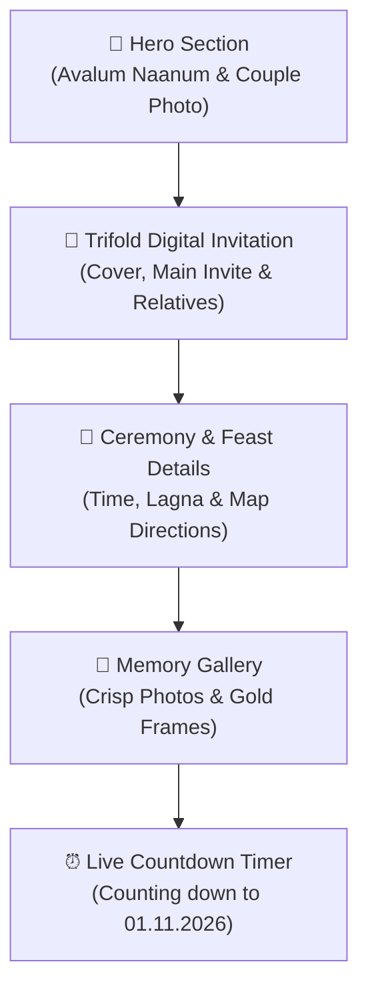

# 🌸 Ramesh ♥ Gowri – Wedding Invitation Website (Final Report)

> **Live GitHub Repository:** [github.com/kkmadlin2023-lgtm/ramesh-gowri-wedding](https://github.com/kkmadlin2023-lgtm/ramesh-gowri-wedding)  
> **Target Date:** Sunday, 01 November 2026 (10:30 AM – 11:45 AM)  
> **Venue:** Krishna Marriage Hall, Suceendram (சுசீந்திரம், அங்காரை)

---

## 📋 Project Summary

The **Ramesh ♥ Gowri** digital wedding invitation website has been designed and built with a traditional yet modern **watercolor green, cream, and maroon** aesthetic. It integrates Tamil cultural elements, smooth sliding invitation cards, gentle animations, and full mobile optimization.



---

## ✨ Key Features & Optimizations

### 1. 🍃 Calm & Serene Animation System
- **Gentle Petal Rain:** Canvas-rendered petals (🌸, 🪷, ✿, ❀) drifting down with natural, slow swaying and subtle opacity.
- **Calm Hero Float:** Smooth 8-second cubic-bezier floating effect for the couple's portrait with soft green-gold lighting.
- **Smooth Panel Transitions:** Frictionless swipe and button navigation across the 3 digital invitation panels with dot indicators.
- **Animated Pet Badges:** Bouncing paw prints (🐾) for *ஜூஜூ*, *புஜிகுமா*, and *லட்டுமா*.

### 2. 🖼️ High Photo Clarity & Framing
- **Optimized Rendering:** Enabled `-webkit-optimize-contrast` for high-DPI smartphone displays and crisp edge rendering.
- **Gold-Trimmed Framing:** Multi-layered soft drop shadows and golden accent borders on the couple portrait and gallery cards.
- **Calm Hover Zoom:** Subtle 1.04x scale transition with smooth cubic-bezier easing.

### 3. 📱 Mobile-First Responsive Design
- **Single-Column Card Slider:** Responsive card tracks with touch swipe gestures on mobile and a 3-column trifold layout on desktop.
- **Scrollable Panels:** Custom thin golden scrollbars on dense text panels (like the relatives list) to ensure comfortable reading without page clutter.
- **Adaptive Typography:** Tamil typography rendered using Google Font *Noto Serif Tamil* paired with *Playfair Display* and *Great Vibes*.

---

## 📜 Full Invitation Content Breakdown

### 🟢 Left Panel: Cover
- **Names:** Ramesh & Gowri
- **Monogram:** `RG` with golden illumination
- **Tamil Caption:** அவளும் நானும் (Avalum Naanum)
- **Photo:** Ramesh & Gowri illustration
- **Date Pill:** 01 · 11 · 2026

### 🟡 Center Panel: Main Invitation (முக்கிய அழைப்பிதழ்)
- **Invocation:** உ — **புலமாடசாமி, கருப்பையா துணை**
- **Title:** திருமண அழைப்பிதழ் · Wedding Invitation
- **Auspicious Time:** அக்ஷய வருஷம் 1202, ஐப்பசி 15 (01.11.2026) ஞாயிற்றுக்கிழமை, பூர நட்சத்திரம், ஸப்தமி திதி, தனுசு லக்னம் (காலை 10:30 – 11:45 மணி).
- **Bridegroom (மணமகன்):**
  - **M. ரமேஷ் D.E.C.E.** (வடசேரி / கொட்டாரம்)
  - **தெய்வத்திருவாளர்கள்:** எம். ராமசாமி (எ) முக்காண்டி – பகவதியம்மாள்
  - **தாய்வழி:** எஸ். சுந்தரம் – பார்வதி · திருமதி முத்தாச்சி
  - **பெற்றோர்:** திரு. ஆர். முத்துசிவம் (எ) சிவதாணு – திருமதி எஸ். இசக்கியம்மாள் (எ) லட்சுமி
- **Bride (மணமகள்):**
  - **S. கௌரி B.Sc(N)** (சேலம், அக்கரை)
  - **தெய்வத்திருவாளர்கள்:** பகவதியப்பன்
  - **பெற்றோர்:** திரு. கோ. சங்கர் – திருமதி ச. வீரலெட்சுமி, அக்கரை
- **Venue:** கிருஷ்ணா திருமண மண்டபம், சுசீந்திரம், அங்காரை.
- **Hosts (அழைப்பின் உரிமையாளர்கள்):**
  - **மணமகள் வீட்டார்:** கோ. சங்கர் & ச. வீரலெட்சுமி (அக்கரை) — 📞 `9930524059`
  - **மணமகன் வீட்டார்:** R. முத்துசிவம் & S. இசக்கியம்மாள் (நாகர்கோவில் · சுசீந்திரம்) — 📞 `7598998769`, `7708233283`
- **Siblings:** அண்ணன் – அண்ணி: M. செந்தில்குமார் – S. ரம்யா (குழந்தைகள்: S. இதவானிகா, S. அகஸ்வின்)
- **Note:** மாலை வரவேற்பு இல்லை (No Evening Reception).

### 🟢 Right Panel: Relatives List (மணமகள் வீட்டார்)
- **தாய்மாமா – அத்தை:**
  - திரு. ப. பாலமுருகன் – திருமதி ப. கலைசெல்வி, நல்லூர்
  - திரு. ப. யுவராஜ் (காலஞ்சென்ற)
  - திரு. கோ. மதியழகன் (காலஞ்சென்ற) – திருமதி அமுதா (காலஞ்சென்ற), வெங்கடாலபுரம்
  - திரு. கோ. மாணிக்கம் – திருமதி மா. முத்துலெட்சுமி
  - திரு. எம். மணிகண்டன் – திருமதி ம. புஷ்பலதா, நல்லூர்
- **அத்தை – மாமா:**
  - திருமதி மு. இசக்கியம்மாள் – திரு. முருகேசன்
  - திருமதி பா. மலர் – திரு. பாரத், வரிசெட்டிபாளையம்
  - திருமதி அமுதா (காலஞ்சென்ற)
- **அக்கா – மாமா:**
  - திரு. ரா. சிலம்பரசன் – திருமதி சி. மணிமேகலை
  - திரு. செல்வமணி – திருமதி சரண்யா
- **அண்ணன் – அண்ணி:**
  - திரு. சரவணன் – திருமதி அன்பரசி, பூங்கவாடி
  - திரு. மா. அருள்மணி – திருமதி ஆ. புவனேஸ்வரி, கெங்கவல்லி
  - திரு. மா. சந்தோஷ்குமார், கெங்கவல்லி
  - திரு. மா. மணியாரதி – திருமதி மா. பிரியதர்ஷினி
  - திரு. சரண்ராஜ், வெங்கடாலபுரம்
- **தம்பி – தங்கை:**
  - ச. வைகுண்டபெருமாள்
  - ச. மகாலெட்சுமி
  - ம. செண்பகமணி
  - ம. நீலாதேவி
- **மழலைச்செல்வங்கள் ✨:**
  - அ. பிரஜித் · ம. தீபஶ்ரீ · ம. தியாஶ்ரீ · சி. இனியாஸ்ரீ · சி. இளையராகுல் · ச. நிஷாந்த் · ச. இளமாறன் · ம. பவித்ரா · பா. அக்ஷயா · பா. மாரி சுதர்சன்
- **எங்கள் வீட்டுச் செல்லப்பிராணிகள் 🐾:**
  - 🐾 ஜூஜூ · 🐾 புஜிகுமா · 🐾 லட்டுமா

---

## 🗂️ Project File Structure

```
ramesh-gowri-wedding/
├── index.html          # Main HTML structure with semantic sections & Tamil content
├── style.css           # Complete responsive stylesheet, animations, watercolor theme
├── script.js           # Falling petals engine, touch-swipe slider, countdown timer
├── couple-cartoon.jpg  # Couple illustration (Hero & Card Cover)
├── invite-card.jpg     # Wedding invitation art asset (Gallery)
├── save-date.jpg       # Save-the-date temple calendar art asset (Gallery)
├── tamil-invite.jpg    # Original invitation print reference
├── README.md           # Documentation & setup guide
└── .gitignore          # Git exclusion rules
```

---

## 🚀 How to Enable Free Live Hosting (GitHub Pages)

1. Open your repository on GitHub: **[github.com/kkmadlin2023-lgtm/ramesh-gowri-wedding](https://github.com/kkmadlin2023-lgtm/ramesh-gowri-wedding)**
2. Click on **Settings** (top navigation).
3. In the left sidebar, click on **Pages**.
4. Under **Build and deployment > Branch**, select:
   - Branch: `main`
   - Folder: `/ (root)`
5. Click **Save**.
6. Within 1–2 minutes, your website will be live at:  
   👉 **`https://kkmadlin2023-lgtm.github.io/ramesh-gowri-wedding/`**
